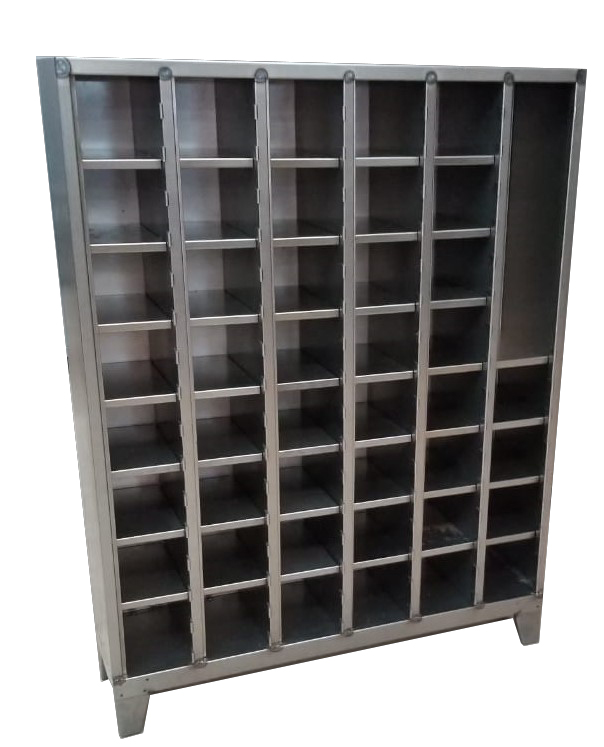
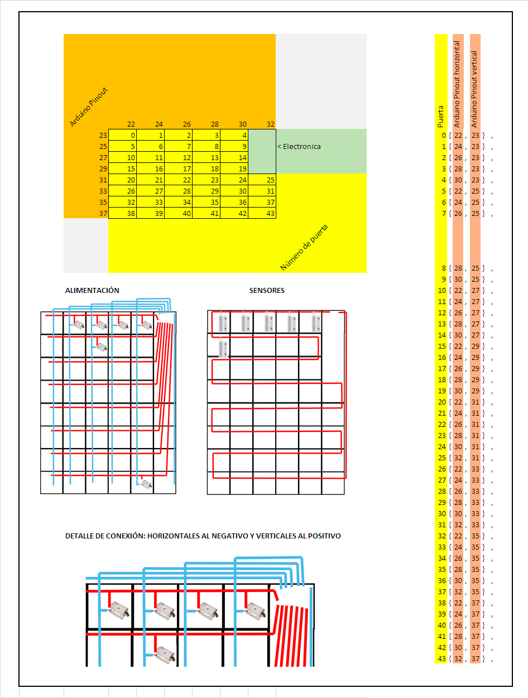
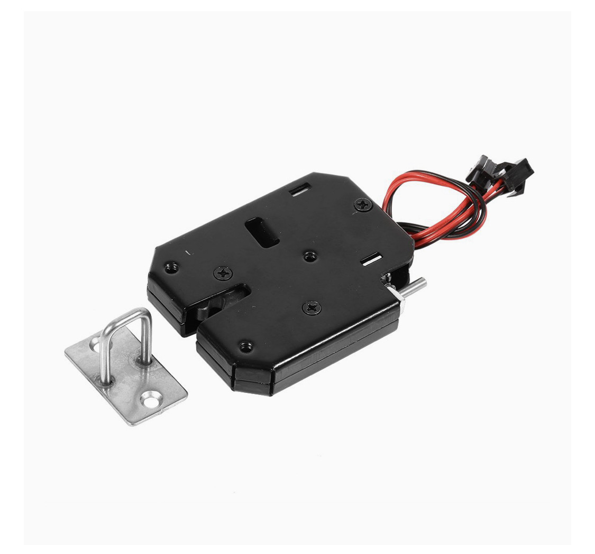
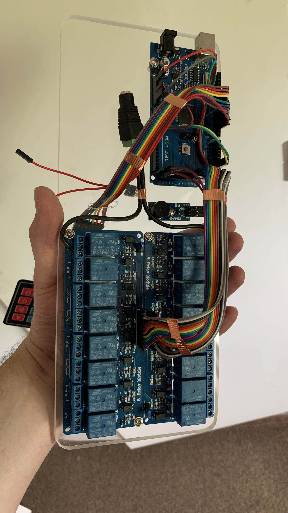
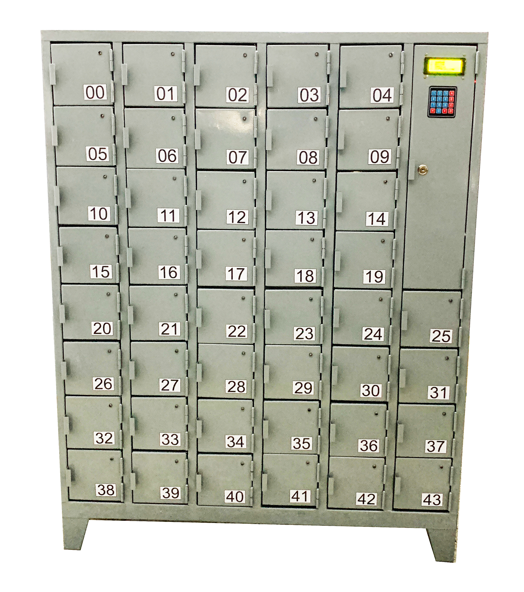

# Locker publico para oficina

En el presente proyecto mostramos cómo construir un locker público electrónico con cierre centralizado para oficina utilizando una Arduino Mega.
En principio es un proyecto bastante simple incluso podríamos decir un proyecto de los primeros años de escuela técnica, aunque en este caso la dificultad reside en la cantidad de casilleros a administrar con una sola placa. 
Queremos obtener un locker con un total de 44 casilleros que son más que la cantidad total de pines de salida de una Arduino, por tanto, lo que vamos a hacer es utilizar una serie de pines de salida para controlar una placa de relés que conecte las cerraduras eléctricas con el pin positivo de una fuente de alimentación, mientras que una segunda serie de pines de salida del Arduino harán lo mismo, pero con el pin negativo de la fuente de alimentación. De esta forma, una de las series de relés, digamos que la que controla el pin positivo de la fuente, administrara las líneas horizontales que atraviesan los casilleros, mientras que la serie de relés que conectan con el pin negativo de la fuente, atravesarán verticalmente a los casilleros. Con esta disposición sólo cuando el relé vertical y horizontal se activen en una determinada combinación sólo una cerradura tendrá alimentación y por tanto será la que se active, liberando así la puerta del Loker.

Por otro lado, es importante saber cuándo la puerta se encuentra abierta y cuando la puerta fue cerrada, ya qué es lo que le indicará a nuestro dispositivo de control cuando el usuario ha iniciado el proceso de apertura y cuando ha terminado con la operación, para así poder proseguir con el bloqueo o liberación del compartimiento. 
Para ello deberemos sensorizar a cada una de las puertas con un sensor magnético similar al que usan las alarmas hogareñas para las puertas. Sabiendo que nuestro código solo habilitará da una puerta a la vez, buscaremos solamente ver de tener continuidad en una única línea. O sea, no es importante tener un sensor individual conectado a nuestra Arduino de forma directa para cada puerta, sino que pondremos a los sensores en serie y buscaremos que sólo un pin del Arduino tenga tensión, de ser así las puertas estarán cerradas y de no serlo, al menos una de ellas estará abierta, presumiblemente la que hayamos energizado.

# Esquema:

A continuación, mostramos una imagen del esqueleto del locker:

En la siguiente imagen se puede observar como se conectar cada puerta:

Ahora bien, probablemente si sos un avezado en electrónica te habrás dado cuenta que la disposición de las cerraduras tiene un problema que consiste en que las bobinas que activan las cerraduras no dejan de ser cables que dejaran pasar corriente a pesar de no ser las directamente conectadas, por lo cual podrían llegar a activar, aunque con menos fuerza a los compartimientos aledaños a la misma línea activada. Para ello deberemos poner antes de cada una de las cerraduras un diodo que fuerza a la corriente a ir en una sola dirección y de esa manera evitar activaciones erróneas.
Nota: No es lo mismo poner un único diodo en cada línea o a la salida de la Arduino. Deben estas justo a la entrada de la bobina de la cerradura.

# Elementos requeridos:
- 1x Arduino Mega
- 44x Sensores magneticos
- 44x Cerraduras para locker
- 1x beeper activo
- 1x fuente de alimentación de 12v 5A
- 2x Placas de reles por 8 reles cada una
- 1x Teclado resistivo
- 1x Pantalla LCD I2C de 4 Lineas
- Cables

# Pasos previos:
Antes de empezar deberemos instalar las librerías ubicadas en la capeta “Liberia” en nuestro entorno Arduino.
Por lo demás solo es conectar, cargar el código y disfrutar.

# Conexiones:
Si bien lo pines de los reles a la Arduino Mega ya los mostramos en el punto “Esquema”, aun nos queda por enunciar donde conectar las demás piezas por lo cual aca una rápida referencia:

-	Beeper Activo: 
PIN 3
+5v
GND

-	Teclado: 
PIN 11
PIN 10
PIN 9
PIN 8 
PIN  7
PIN 6
PIN 5
PIN 4 

-	LCD: 
PIN 20
PIN 21
+5v
GND

Nota: Las cerraduras deberán ser conectadas a los reles y estos a la fuente de forma directa, o sea que las cerraduras no tomarán energía de la Arduino sino de la fuente.
# Cerraduras:
Si bien es posible usar pestillos tipo solenoide de corriente directa a 12V lo mas recomendable es usar una cerradura para locker como mostrada a continuación ya que estas tienen expulsor de puerta y por tanto una vez puesta la clave la puerta seleccionada se abrirá automáticamente.

# Modo de uso:

El sistema cuenta con 3 claves maestras las cuales no deberán ser reveladas a los usuarios del locker y serán solo para uso del administrador de este en caso de falla, perdida de clave o mantenimiento. 

Cada una de estas 3 claves inicia con el código:

ASTERISCO + 000 

Seguido del “CÓDIGO DE FUNCIÓN DE 5 DIGITOS” y termina con dos veces NUMERAL

Al apretar NUMERAL + 000 se escuchara un beep corto indicando que estamos en modo de administracion. Al ingresar los siguientes 5 dígitos se activará la función maestra seleccionada:

*00025500## : Desactiva los sensores magnéticos y deja al sistema funcionando por tiempo
*00075569## : Resetea todas las claves del Locker 
*00023434## : Permite cambiar la clave de un casillero en caso que el usuario olvidada la ingresada.

Para el uso general del locker a nivel usuario los pasos son mostrados en pantalla, pero se podría resumir de la siguiente forma:

Se inicia un proceso seleccionando una de las letra de la A a la D que tiene el teclado donde según la pantalla en la que se esté tendrán distintas funciones. Por ejemplo, en la pantalla inicial:

A: DEJAR UN OBJETO EN EL LOCKER
B: RETIRAR UN OBJETO DEL LOCKER
C: CANCELAR LA FUNCIÓN EN CURSO
D: VER CUANTOS CASILLEROS ESTAN LIBRES

# Imágenes finales de la placa:

